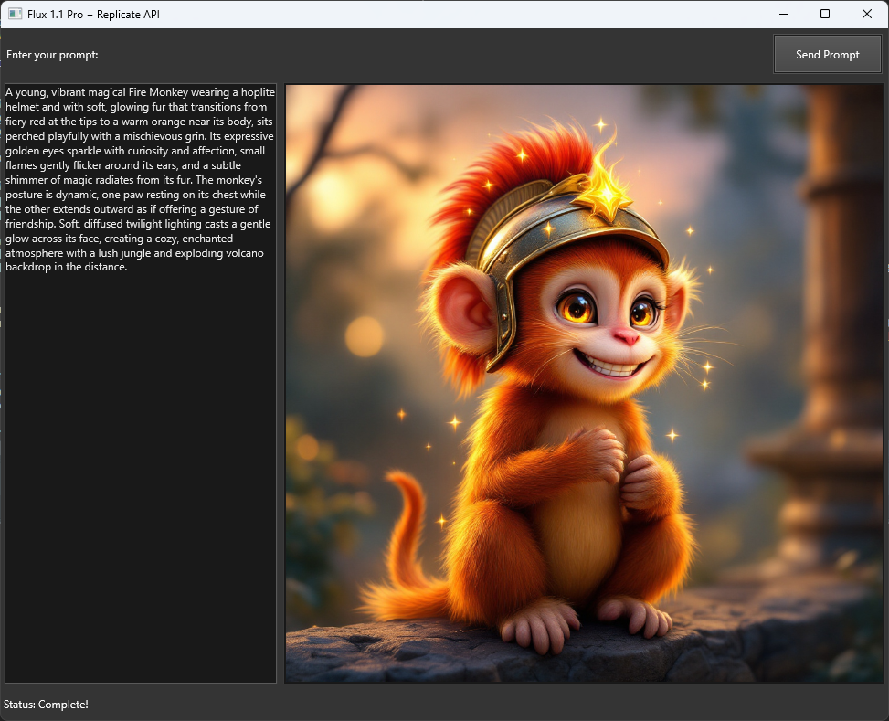

# Flux 1.1 Pro Text Prompt Desktop GUI

This project is a **DelphiFMX** desktop application built with Python that uses the **Replicate API** to generate images from text prompts. It utilizes the [black-forest-labs/flux-1.1-pro](https://replicate.com/black-forest-labs/flux-1.1-pro) model to generate and display images based on user input.

The graphical user interface (GUI) provides an intuitive experience, allowing users to input detailed prompts, send them to the Flux 1.1 Pro model, and view the generated images directly within the app.

## Features

- Input text prompts to generate images.
- Display the generated image within the app.
- User-friendly GUI built with **DelphiFMX**.
- Real-time status updates during image generation.
- Error handling and display of process feedback.
- Uses the **Replicate API** to interact with the Flux 1.1 Pro model.

## Technologies Used

- **Python** for application logic and Replicate API integration.
- **DelphiFMX** for the desktop GUI (cross-platform capability).
- **Replicate API** to send text prompts and retrieve generated images.

## Screenshot

Below is a screenshot of the GUI in action:



## Prerequisites

Before running this project, you will need:

1. **Python 3.x** installed on your system.
2. The following Python libraries installed:
   - `replicate`: For interacting with the Replicate API.
   - `delphifmx`: For building the desktop GUI using DelphiFMX.
   - `urllib` and `hashlib`: For image downloading and file handling.

   You can install the dependencies via pip:

   ```bash
   pip install replicate delphifmx
   ```

3. A valid **Replicate API key**. Sign up at [Replicate](https://replicate.com) to obtain your API key, then set it in the environment variable `REPLICATE_API_TOKEN`.

## Installation

1. Clone this repository:
   ```bash
   git clone https://github.com/yourusername/flux-1.1-pro-gui.git
   cd flux-1.1-pro-gui
   ```

2. Set your Replicate API key:
   ```bash
   export REPLICATE_API_TOKEN="your_replicate_api_key"
   ```

3. Run the application:
   ```bash
   python main.py
   ```

## How It Works

1. **Text Input**: The user enters a text prompt that describes the image they want to generate.
2. **Send Prompt**: Upon pressing the "Send Prompt" button, the app sends the text to the **Flux 1.1 Pro** model hosted on Replicate.
3. **Image Generation**: The app retrieves the generated image and displays it inside the application window.
4. **Status Updates**: The status bar at the bottom of the window shows the progress of the image generation (e.g., "Processing...", "Complete!", or any error messages).

## Usage Example

1. Enter a detailed prompt, such as:
   ```
   A young, vibrant magical Fire Monkey wearing a hoplite helmet and with soft, glowing fur that transitions from fiery red at the tips to a warm orange near its body, sits perched playfully with a mischievous grin.
   ```
2. Click the "Send Prompt" button.
3. Watch the progress in the status bar, and once the image is ready, it will be displayed in the app.

## Key Functions

- `__send_prompt`: Sends the user input (prompt) to the Flux 1.1 Pro model via the Replicate API.
- `__start_prompt_process`: Handles the prediction process and manages the image generation.
- `__on_timer_tick`: Periodically checks the status of the image generation and displays the image when the process completes.

## Links

- [Replicate API Documentation](https://replicate.com/docs)
- [DelphiFMX Documentation](https://pypi.org/project/delphifmx/)
- [black-forest-labs/flux-1.1-pro Model](https://replicate.com/black-forest-labs/flux-1.1-pro)

## License

This project is licensed under the MIT License. See the [LICENSE](LICENSE) file for more details.

## Acknowledgments

- Thanks to [Replicate](https://replicate.com) for providing the API and model hosting.
- Special thanks to [DelphiFMX](https://pypi.org/project/delphifmx/) for the cross-platform GUI framework.
